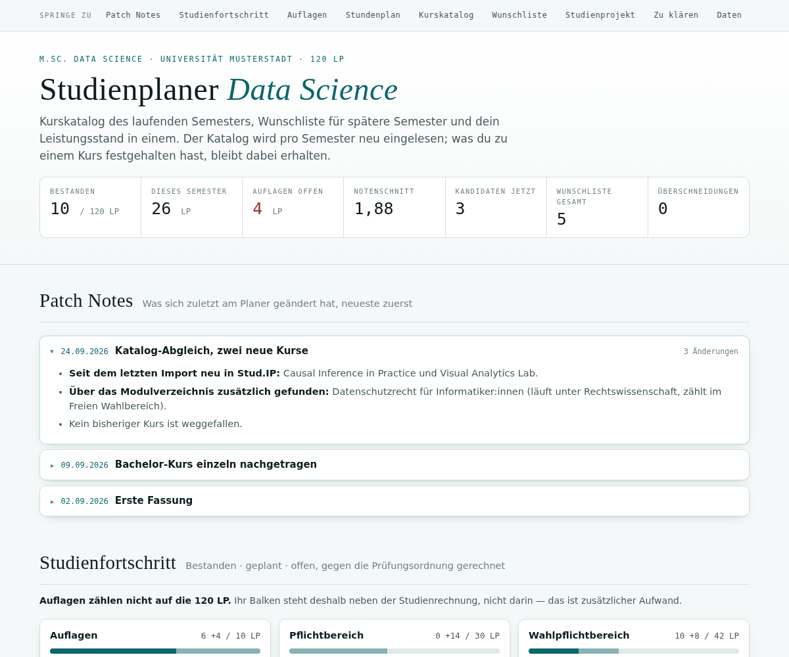

# Study Planner for Claude · Studienplaner für Claude

A Claude plugin that builds and maintains a **personal study planner** as a live artifact: this term's course
catalogue with a rating for you, a timetable that checks clashes, a wishlist for later terms, and your progress
against the examination regulations. Imports from **Stud.IP** and other campus systems. German and English.

Ein Claude-Plugin, das dir einen **persönlichen Studienplaner** baut und pflegt: Kurskatalog des Semesters mit
Einschätzung für dich, Stundenplan mit Überschneidungsprüfung, Wunschliste und Leistungsstand gegen die
Prüfungsordnung. Liest aus **Stud.IP** und anderen Campus-Systemen. Deutsch und Englisch.



## Install · Installieren

**Claude app:** *Customize → Plugins → Add marketplace* → `zothken/study-planner` → install **study-planner**.

**Claude Code:**
```
/plugin marketplace add zothken/study-planner
/plugin install study-planner@zothken-plugins
```

Files for manual install / Dateien für die manuelle Installation: [`dist/`](dist/)

## Setup guide · Einrichtung

- [Step-by-step setup (English)](plugins/study-planner/skills/study-planner/README.md)
- [Einrichtung Schritt für Schritt (Deutsch)](plugins/study-planner/skills/study-planner/README.de.md)

## What's inside · Aufbau

```
.claude-plugin/marketplace.json          marketplace "zothken-plugins"
plugins/study-planner/                   the plugin
  skills/study-planner/SKILL.md          instructions for Claude
  skills/study-planner/assets/           planner engine (HTML) + worked example
  skills/study-planner/scripts/          build/check/extract, headless verification, Stud.IP helpers
  skills/study-planner/references/       data model, campus systems, regulations, house rules
dist/                                    .plugin and skill .zip for manual install
docs/img/                                screenshots (fictional example data)
```

All screenshots and the bundled example use made-up data. / Alle Screenshots und das Beispiel sind erfunden.

## License · Lizenz

MIT — see [LICENSE](LICENSE). / MIT — siehe [LICENSE](LICENSE).
