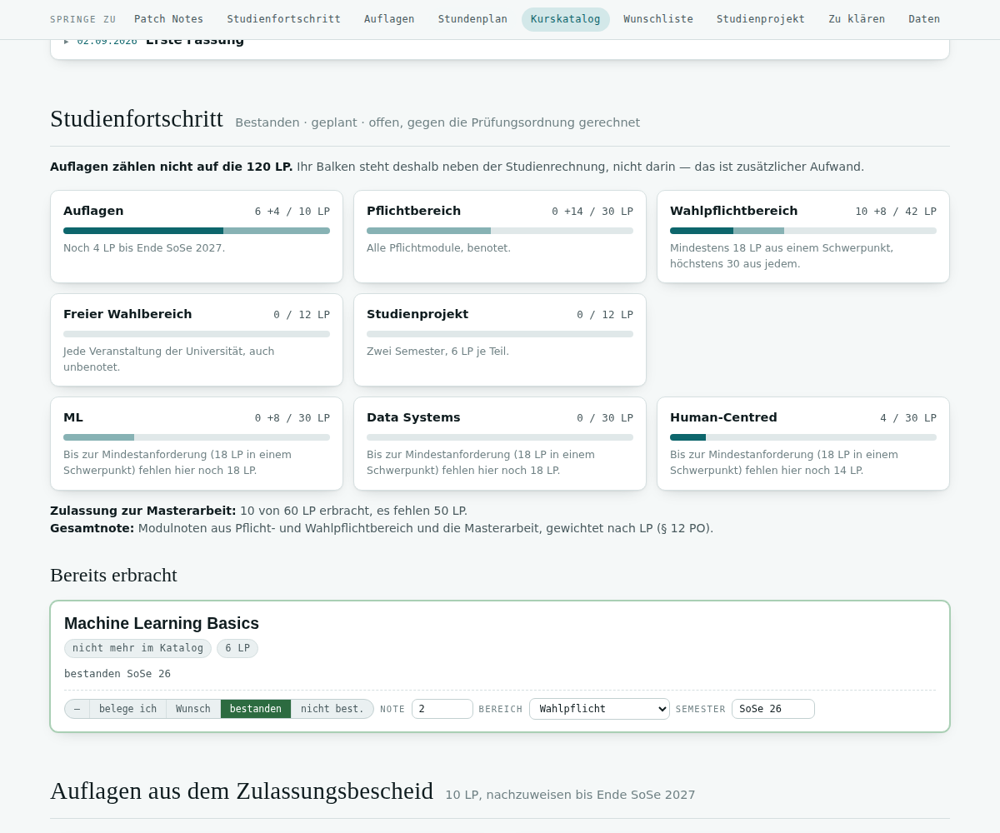
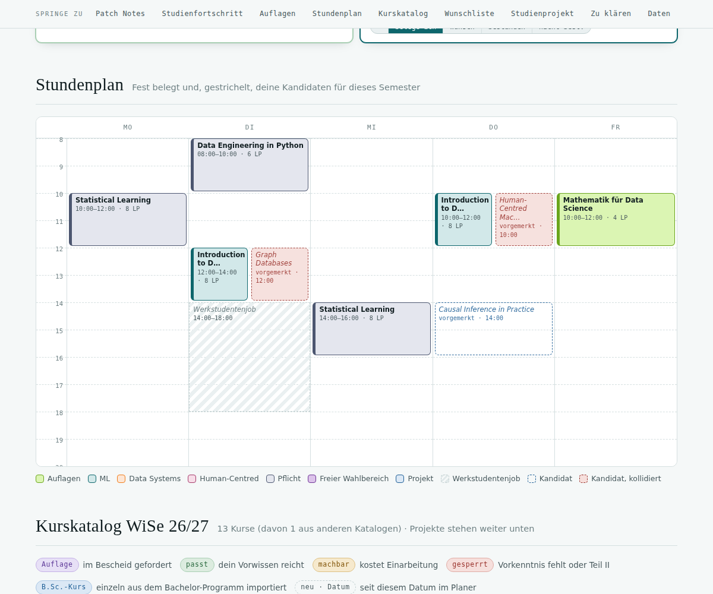
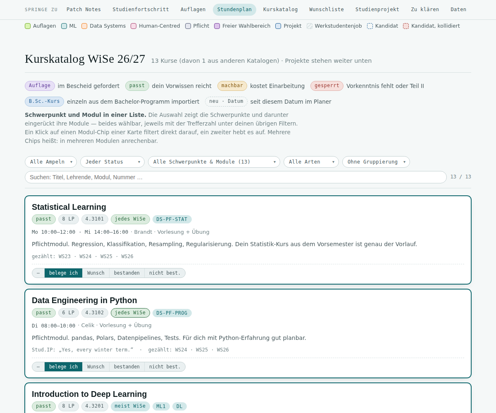

# Study Planner for Claude — step-by-step setup

*Deutsche Version: [README.de.md](README.de.md)*

This skill lets Claude build and maintain a **personal study planner**: one page with your term's course
catalogue, a timetable that checks for clashes, your wishlist, and your progress against the examination
regulations. Your ticks, grades and wishes are saved and survive when Claude imports the new courses every term.


---

## Contents
1. [What you need](#1-what-you-need)
2. [Install](#2-install)
3. [Get your documents ready](#3-get-your-documents-ready)
4. [Connect Stud.IP (or your campus system)](#4-connect-studip-or-your-campus-system)
5. [Have Claude build your first planner](#5-have-claude-build-your-first-planner)
6. [Tour: what you see when you first open it](#6-tour-what-you-see-when-you-first-open-it)
7. [Keeping it up to date](#7-keeping-it-up-to-date)
8. [Privacy and limits](#8-privacy-and-limits)
9. [FAQ](#9-faq)
10. [For developers](#10-for-developers)

---

## 1. What you need

- A **paid Claude plan** (Pro, Max, Team or Enterprise) — plugins and published pages with storage need it.
  Under *Settings → Capabilities*, **“Code execution and file creation”** must be on.
- The **Claude desktop app** (Windows or macOS) — recommended, because it has a built-in browser where you sign
  in to your campus system yourself. Alternatively the **Claude in Chrome** extension.
- Access to your **campus system** (Stud.IP, HISinOne, LSF, CAMPUSonline …) — or at least the course catalogue
  as a PDF.

## 2. Install

Pick **one** route. Route A is the most convenient because you get updates automatically.

### A — Plugin from the marketplace (recommended)

1. Open Claude (desktop app or claude.ai) and go to **Customize** in the sidebar → **Plugins**.
2. Choose **Add marketplace** and enter:
   ```
   zothken/study-planner
   ```
3. **study-planner** appears under **Discover**. Click **Install**.
4. Optional: turn on **Sync automatically** for the marketplace so improvements arrive on their own.

### B — Plugin file

1. Download [`dist/study-planner.plugin`](../../../../dist/study-planner.plugin) from this repository.
2. **Customize → Plugins** → upload option → pick the file.

### C — Skill only

1. Download [`dist/study-planner-skill.zip`](../../../../dist/study-planner-skill.zip) (don't unzip it).
2. **Customize → Skills** → **“+”** → **“+ Create skill”** → **“Upload a skill”** → pick the ZIP.
3. Switch the skill on in the list.

### D — Claude Code (terminal)

```
/plugin marketplace add zothken/study-planner
/plugin install study-planner@zothken-plugins
```

> **Quick check:** ask Claude “How do I set up the study planner?”. If it answers with steps from this guide,
> the skill is active.

## 3. Get your documents ready

Claude can only plan as well as the rules it knows. Put these files in a folder (e.g. `Uni/Orga`) that you
connect to the conversation in the desktop app, or upload them to the chat or a project:

| Document | Used for |
|---|---|
| **Examination regulations** (programme-specific part, current version) | areas, credits, track rules, thesis admission, final grade |
| **Module handbook** | which courses count in which module and track |
| **Admission letter** (if admitted with conditions) | conditions, credits, deadline |
| **Transcript of records** (if you already passed something) | completed courses with grades |
| optional: **screenshot of your Stud.IP timetable** | Claude copies its colours per track |

## 4. Connect Stud.IP (or your campus system)

There is **nothing to install and no API key**. Claude reads the catalogue through your own signed-in browser
session — exactly what you could see yourself.

**Stud.IP**
1. Tell Claude your Stud.IP address (e.g. `https://studip.uni-osnabrueck.de`).
2. Claude opens it in the desktop app's browser pane. **Sign in there yourself** (university login, 2FA and
   all). Claude never types a password and never asks for one.
3. Claude then reads your programme's course directory, cross-checks it with the **module directory** (courses
   from other faculties that count for you but are missing from the tree), opens every course page, and counts
   in which terms each course ran.
4. Claude stores the ids it found inside the planner itself — the next import is faster.

Stud.IP sessions expire quickly. If Claude says you're back on the login page, just sign in again; Claude
continues on its own. Claude **changes nothing in Stud.IP** — no registrations, no posts.

**Other systems** (HISinOne, LSF/QIS, CAMPUSonline/TUMonline, CampusNet, …)
- Give Claude the link to the course catalogue. Many catalogues are public, then no login is needed.
- Otherwise it works like Stud.IP: you sign in in the browser pane, Claude reads.
- If neither works, a **PDF of the catalogue**, a **calendar export (ICS)** or a pasted course list is enough.

## 5. Have Claude build your first planner

Write something like:

> Build me a study planner for my M.Sc. Data Science at the University of X, regulations 2024, winter term
> 2026/27. Our catalogue is at https://campus.uni-x.de. The regulations and module handbook are in my folder
> Uni/Orga; I'll upload my admission letter.

What happens next:
1. Claude reads your documents and asks **a few short questions**: background from your previous degree,
   interests, fixed commitments (job, commute), how many credits you're aiming for this term.
2. Claude shows you a **summary of the rules** it read from the regulations (e.g. “44 credits electives, at
   least 20 from one track”). Correct anything that's wrong here.
3. Claude opens your campus system — **you sign in** — and reads all courses.
4. Claude rates every course for you, writes a short assessment, checks the page and publishes it as an
   **artifact** “Study planner …”. You'll find it in your artifact gallery on claude.ai and can pin it.

The first run takes 20–40 minutes depending on the catalogue. You don't need to watch.

## 6. Tour: what you see when you first open it

A **navigation bar** stays at the top; below it are the **key figures**: credits passed of the total, credits
planned this term, open conditions, average grade, candidates, wishlist, and clashes (red as soon as there are any).

**Patch notes** — what changed in the latest updates, newest first; only the newest is expanded. New courses
carry a dashed **“new · date”** chip in the catalogue.

**Progress** — one bar per area of your regulations. Dark = passed, light = planned (“taking”). Below: track
bars with their minimum and maximum, and a line on thesis admission. Admission conditions sit **next to** the
degree calculation when they don't count toward the total.



**Conditions** — only if your admission came with conditions: those already passed and those running this term.

**Timetable** — everything set to **“taking”**, in its track colour. **Dashed** are courses you shortlisted as a
**wish for this term** (candidates). Only a candidate that sits on something booked turns **red** — booked
courses never turn red; the clash is written on their card instead. Courses without a weekly slot (block
courses) are listed below.



**Course catalogue** — each card shows:
- the **rating**: *fits* (your background covers it), *doable* (needs catching up), *blocked* (missing
  prerequisite or part II), *condition*;
- credits, course number, **frequency** (strong outline = the lecturers said so, pale = counted from history),
  module chips (click to filter by module);
- times, lecturers, an **assessment written for you** and any clashes;
- the **status buttons**: *taking*, *wish*, *passed*, *failed*.

The filters narrow by rating, your status, track/module and format; group by track, module, rating or
frequency; search titles, lecturers and numbers.



**Wishlist & upcoming terms** — everything on “wish”, split into “candidates for now” and “for later terms”
(target term selectable on the card), plus recurring courses not offered this term.

**Projects** (if your programme has one), **To clarify** (open questions; resolved ones stay ticked) and
**Your data**: where it's stored, **“Save as JSON”** (backup — keep it in your uni folder), “Load JSON”, “Reset
everything” (asks twice).

**How to use it**
- **taking** → counts as planned in the bars and appears solid in the timetable.
- **wish** → with target “current term” a dashed candidate in the timetable; with a later target a note for later.
- **passed** → enter grade, area and term; this feeds the bars and the average.
- Your entries live in the **artifact database** and are the same on every device where you're signed in to Claude.

## 7. Keeping it up to date

Just tell Claude what you need — the skill does the rest and records every change in the patch notes:

| You write … | Claude … |
|---|---|
| “Check Stud.IP for new courses.” | re-imports, marks new ones “new”, keeps your entries |
| “New term: plan summer 2027.” | switches the term, imports the new catalogue, updates frequencies |
| “Add the Bachelor course *Introduction to Neuroinformatics*.” | fetches exactly that course, with a “B.Sc.” chip |
| “I'm enrolled in X, Y and Z.” | sets them to “taking”, removes outdated hints |
| “The module question is resolved: …” | ticks the item and adjusts the card |
| “Use the colours from my Stud.IP timetable.” + screenshot | adjusts the colours per track |

## 8. Privacy and limits

- The planner is a **private artifact** in your Claude account. Because it uses a database it cannot be shared
  publicly.
- Claude reads your campus system only in your own session, **changes nothing there** and never asks for passwords.
- Ratings, frequency and the reading of the regulations are **estimates**. Only the regulations and your
  examination office are binding — when in doubt, ask them (Claude creates “To clarify” items for that).
- The JSON backup is the only copy that survives losing the artifact.

## 9. FAQ

**Courses I see in Stud.IP are missing.** They often live in another faculty. Tell Claude the title; the
module-directory cross-check is part of every import, and single courses can be added any time.

**Two courses always change status together.** They share an internal key (very similar titles). Tell Claude —
the check before every publish catches this, and older planners can be repaired.

**My entries are gone.** Open the planner on claude.ai signed in with the same account. If that doesn't help:
“Your data → Load JSON” with your latest backup.

**Does it work without the desktop app?** Yes, if your catalogue is public or you provide it as PDF/list. For
catalogues behind a login you need the desktop app's browser or Claude in Chrome.

**German?** Yes — write to Claude in German and the planner will be German.

## 10. For developers

- `assets/planner-template.html` is the engine (design, logic, DE/EN strings). Everything individual sits in
  two JSON blocks: `#planner-config` (regulations, tracks, modules, colours, import recipe) and
  `#planner-data` (courses, patch notes, notices, open questions).
- `scripts/planner.py extract|check|build` pulls the JSON blocks out of a published planner, validates them
  (duplicate keys, bad times, module/track mismatches, patch-note rules) and builds the page.
- `scripts/verify.mjs` renders light/dark and phone/desktop against a database stub and takes screenshots.
- `scripts/lms/studip/studip-helpers.js` holds the Stud.IP import functions for the browser.
- Try it: `python3 scripts/planner.py build --config assets/example/config.json --data assets/example/data.json -o example.html`.

Bugs and ideas: issues on [zothken/study-planner](https://github.com/zothken/study-planner).
